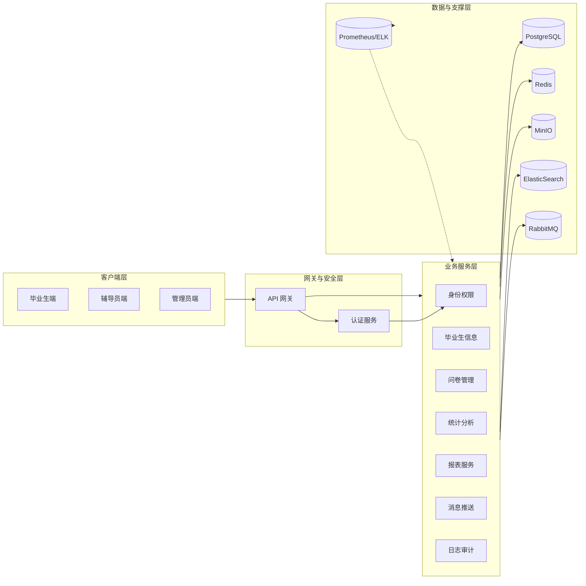
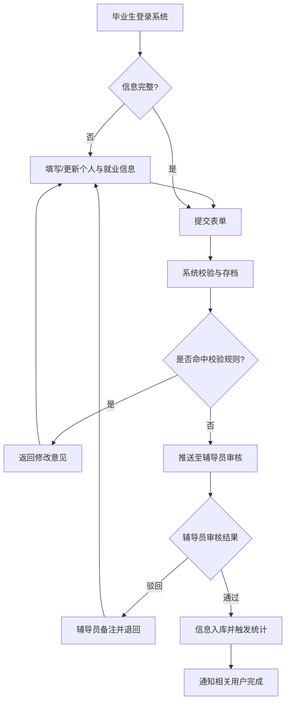
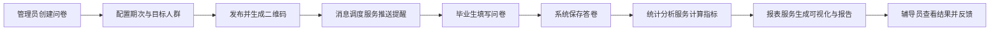
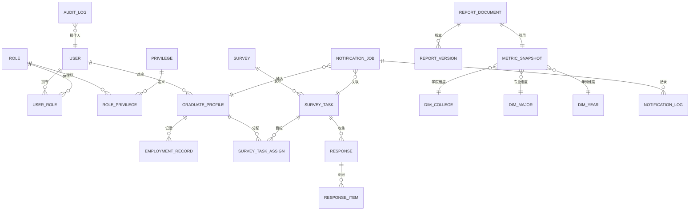
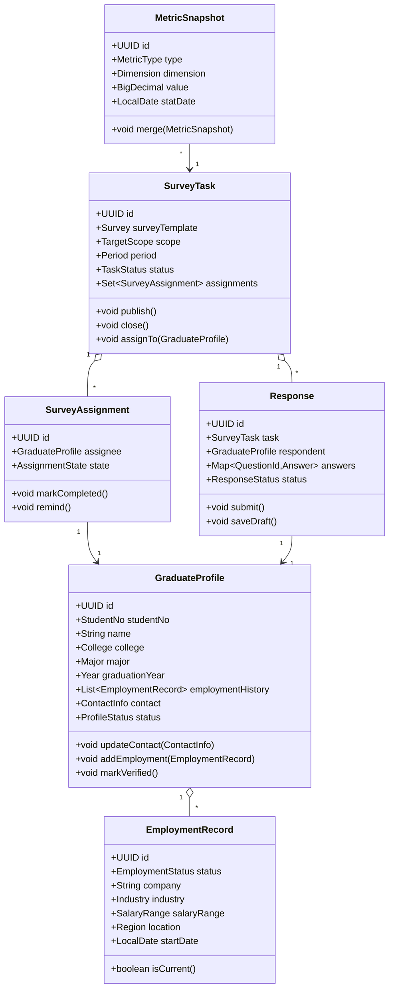
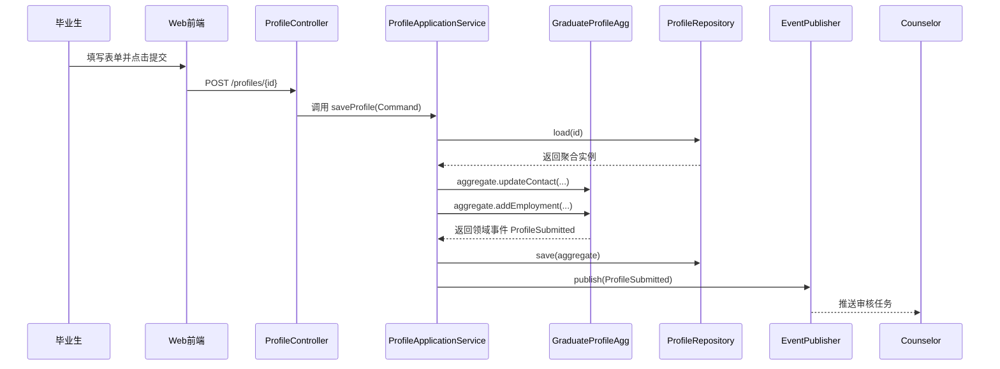
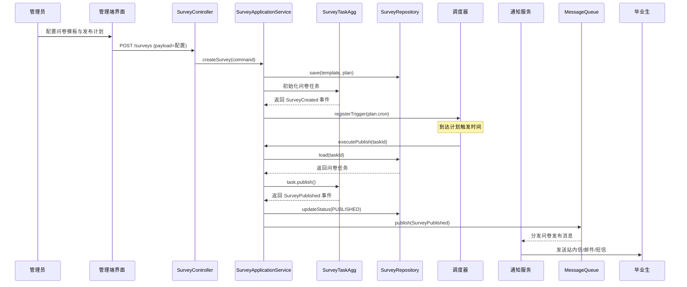
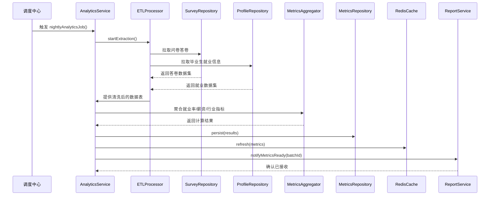
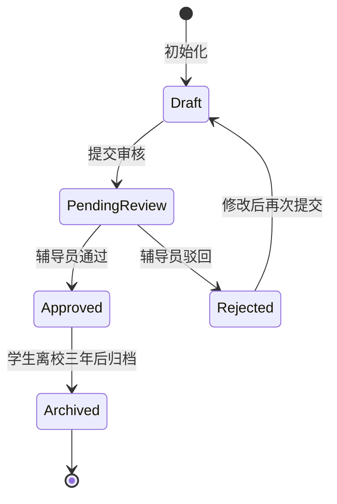
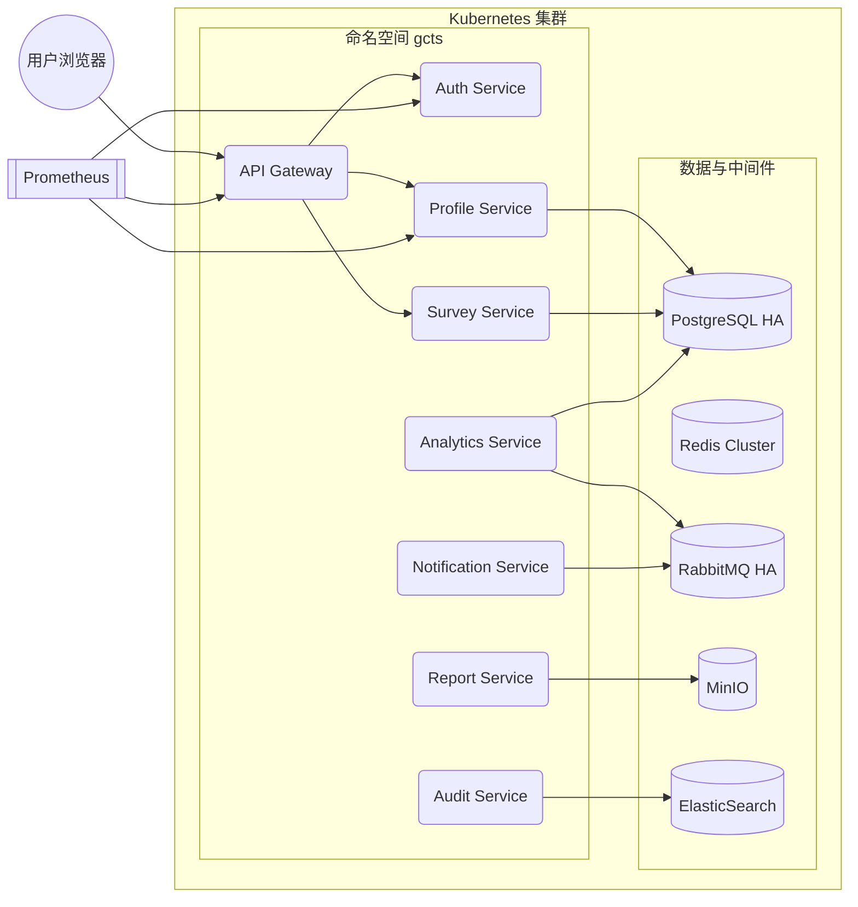

# 高校毕业生事业发展跟踪管理系统（GCTS）详细设计说明书

## 1. 引言

### 1.1 编写目的
本详细设计说明书在需求规格说明书的基础上，明确高校毕业生事业发展跟踪管理系统（Graduate Career Tracking System，GCTS）的系统结构、模块划分、数据模型、接口定义以及实现要点。文档面向软件架构师、开发人员、测试人员与运维人员，作为系统实现、联调与验收测试的直接依据。

### 1.2 背景
GCTS 旨在满足教育主管部门对高校毕业生就业与职业发展进行持续跟踪和数据分析的要求，解决传统人工统计方式数据分散、时效性差、无法形成闭环的问题。系统将支撑毕业生信息采集、问卷调查、消息推送与报表分析等业务流程，与学校已有教务与消息系统进行集成。

### 1.3 参考资料
- 《高校毕业生事业发展跟踪管理系统（GCTS）需求规格说明书》
- 教育部《全国普通高等学校毕业生就业统计调查制度》
- OAuth 2.0 与 OpenID Connect 标准规范
- 学校统一身份认证系统（SSO）集成指南
- Prometheus 与 ELK 平台接入规范

### 1.4 术语定义及说明
- **GCTS**：高校毕业生事业发展跟踪管理系统。
- **RBAC**：基于角色的访问控制模型。
- **SSO**：统一身份认证系统（Single Sign-On）。
- **ETL**：抽取、转换、加载（Extract-Transform-Load），用于数据汇总与分析。
- **ODS**：操作型数据存储层，用于短期历史数据留存。

## 2. 设计概要

### 2.1 任务和目标
- 构建面向毕业生、辅导员、管理员三类角色的多端访问能力，提供信息采集、审核、统计与报告功能。
- 实现问卷调查、消息推送与外部系统对接的全流程自动化，确保数据完整性与一致性。
- 支撑 500 并发用户的可靠访问，对关键指标提供实时监控与日志审计能力。
- 提供可扩展的模块化架构，便于后续按学院或年份扩展数据规模。

### 2.2 需求概述
需求涵盖功能性需求（FR-01 至 FR-10）与非功能性需求（NFR-01 至 NFR-07）。功能性需求覆盖用户登录与权限控制、信息管理、问卷与报表、消息推送、日志审计与外部接口。非功能需求强调性能、可用性、安全性、可维护性、可扩展性、可移植性与可观测性。本设计将需求分解为多个服务与模块，并定义其接口、数据模型和关键技术方案。

### 2.3 运行环境概述

#### （1）运行环境
- **服务器操作系统**：CentOS 8 或 Ubuntu Server 22.04。
- **运行容器**：Docker 20.10+ 与 Kubernetes 1.25+ 集群。
- **中间件**：Nginx 反向代理、Redis 作为缓存与消息队列、RabbitMQ 用于异步通知、Prometheus + Grafana 监控、ELK 日志收集。
- **数据库**：PostgreSQL 14 主从集群，MinIO 对象存储用于附件与报表存放。
- **安全**：HTTPS + WAF，接入学校统一身份认证系统。

#### （2）开发环境
- **编程语言**：后端使用 Java 17 + Spring Boot 3.x，前端使用 Vue 3 + TypeScript。
- **开发工具**：IntelliJ IDEA、WebStorm、VS Code、Postman、GitLab CI/CD。
- **依赖管理**：Maven、pnpm。
- **测试工具**：JUnit 5、Jest、Cypress、SonarQube。

### 2.4 条件与限制
- 必须遵循学校信息安全与数据隐私管理规定，涉及敏感信息需加密存储与访问日志审计。
- 与统一身份认证系统、教务系统、消息推送服务对接的接口与协议需遵循现有规范，不得擅自变更。
- 报表生成需符合教育主管部门的报送格式，需提供 PDF 与 Word 双格式输出。
- 系统部署需适配学校现有私有云 Kubernetes 平台。

### 2.5 详细设计方法和工具
- **架构设计方法**：采用领域驱动设计（DDD）与分层架构结合，应用层负责业务编排，领域层实现核心逻辑，基础设施层提供数据访问与外部接口。
- **建模工具**：使用 Draw.io 与 PlantUML 绘制架构图、流程图与类图。
- **数据库设计工具**：Navicat Data Modeler 与 ERMaster。
- **文档管理**：Git + Markdown，使用 CI 检查文档结构与链接。

## 3. 系统详细需求分析

### 3.1 详细需求分析

#### （1）详细功能需求分析
- **用户登录与认证（FR-01）**：通过 OAuth 2.0 + OIDC 接入学校 SSO，支持多角色登录，登录后分配会话令牌；提供二次身份验证（短信/邮件）。
- **信息录入与更新（FR-02）**：毕业生端提供基本信息、就业信息表单与附件上传；支持保存草稿、修改历史、字段校验与对照教务库进行校准。
- **信息审核与导出（FR-03）**：辅导员可按学院、班级、状态筛选；批量审核与驳回；支持导出 Excel/CSV，自定义字段模板。
- **问卷管理（FR-04）**：管理员配置问卷模板，支持多期任务、题库复用、二维码分享、回收统计、导出原始答卷。
- **数据分析与统计（FR-05）**：提供就业率、薪资区间、行业分布、地域分布、就业去向等指标的图表展示，支持按学院、专业、毕业年份、问卷期次筛选。
- **报表生成（FR-06）**：基于分析结果自动生成年度报告，可插入图表、动态摘要，支持版本管理与历史留存。
- **消息推送（FR-07）**：支持短信、邮件、站内信与微信企业号推送；提供任务队列防止重复提醒，记录送达状态。
- **权限与角色管理（FR-08）**：采用 RBAC，将权限分配到角色，再授权用户；提供最小权限原则、权限审批流程与审计。
- **日志与审计（FR-09）**：记录登录、数据变更、导出、推送等关键操作，支持查询、过滤、导出，保留 3 年历史。
- **外部接口（FR-10）**：定时从教务系统同步学生基础数据，实时调用消息服务接口发送提醒；开放 RESTful API 给校内系统查询统计结果。

#### （2）详细性能需求分析
- 登录、数据查询与报表生成的响应时间需在 2 秒内，批量导出与报告生成操作可在 10 秒内完成。
- 支撑 500 并发用户，峰值期间服务 CPU 利用率不超过 70%，内存占用控制在 60% 以内。
- 问卷提交支持 1,000 QPS 峰值写入，采用缓存与批量写入策略保障性能。
- 报表计算任务采用分布式调度，保障在 30 分钟内完成当日全量统计。

#### （3）详细资源需求分析
- 生产环境至少 3 台应用节点（8 核 CPU、16 GB 内存），1 套数据库主从集群（主节点 16 核 32 GB），1 套 Redis 与 RabbitMQ 高可用集群。
- 对象存储（MinIO）配置 5 TB 空间，满足报表、附件与日志归档需求。
- 日志与监控服务器单独部署，保证至少 30 天热数据存储。

### 3.2 详细系统运行环境及限制条件分析接口需求分析

#### （1）系统接口需求分析
- **SSO 接口**：基于 OAuth 2.0 Authorization Code 模式，需实现回调验证、Token 刷新与用户信息同步。
- **教务系统接口**：采用定时调用 RESTful API 与数据库视图同步，数据传输通过 VPN 与 HTTPS 加密。
- **消息服务接口**：提供短信、邮件、微信推送 REST API，需支持异步回执与失败重试。
- **统计报表开放接口**：提供只读 API 与 GraphQL 查询，供校内其他系统按权限访问统计数据。

#### （2）现有软硬件资源接口需求分析
- **LDAP/AD**：使用现有校园 LDAP 目录获取辅导员组织架构信息。
- **统一短信网关**：复用学校短信平台提供的 HTTP API。
- **邮件服务器**：使用 SMTP over TLS 连接校内邮件系统。
- **监控告警**：通过 Prometheus Exporter 与 ELK Filebeat 接入现有监控告警平台。

## 4. 总体方案确认

### 4.1 系统总体结构确认
系统采用前后端分离 + 微服务架构。整体分为：
- **前端层**：Vue 3 单页应用，包含毕业生端、辅导员端与管理员端，通过统一登录门户访问。
- **网关层**：Nginx + Spring Cloud Gateway，负责请求路由、权限校验、流量控制与安全防护。
- **业务服务层**：包括用户与权限服务、信息管理服务、问卷服务、统计分析服务、报表服务、消息调度服务、日志审计服务等，服务间通过 REST/gRPC 通信，并使用服务注册中心（Eureka 或 Nacos）。
- **数据层**：PostgreSQL 数据库、Redis 缓存、MinIO 对象存储、ElasticSearch 日志索引。
- **数据分析层**：Spark 或 Flink 批处理任务负责统计分析，定期将结果写回 PostgreSQL 与缓存。
- **运维支撑层**：包含 CI/CD、监控、日志、配置中心（Spring Cloud Config）、消息队列（RabbitMQ）。

### 4.2 系统详细界面划分
- **毕业生端**：
  - 个人信息概览页
  - 基本信息/就业信息编辑页
  - 问卷任务列表与填报页
  - 通知消息中心
  - 报表反馈查看（查看个人反馈、下载证明）
- **辅导员端**：
  - 学生列表与筛选页
  - 审核工作台（批量审核、驳回、备注）
  - 数据统计大屏（学院/班级维度）
  - 导出管理页
  - 消息任务配置页
- **管理员端**：
  - 角色与权限管理页
  - 问卷配置与题库管理页
  - 报表模板管理与生成页
  - 系统监控页（服务状态、任务调度）
  - 操作日志查询页

## 5. 系统详细设计

### 5.1 系统结构设计及子系统划分
系统根据业务领域划分为以下子系统：
1. **身份与权限子系统**：实现用户管理、角色权限、SSO 集成、多因子认证。核心组件包括认证服务、授权服务、RBAC 管理界面。
2. **毕业生信息子系统**：负责毕业生基础数据、就业信息、历史版本与附件管理，支持与教务系统同步，包含数据校验与变更日志。
3. **问卷与调查子系统**：提供问卷模板、期次管理、问卷发布、答卷采集、问卷统计，支持题库管理与问卷版本控制。
4. **统计分析子系统**：基于 ETL 管道与分析模型生成就业数据统计指标，输出图表接口与报表基础数据。
5. **报表与文档子系统**：管理报表模板、自动生成年度报告、版本归档、报表导出、审批流。
6. **消息推送子系统**：调度通知任务、发送短信/邮件/微信、跟踪送达状态、提供重试机制。
7. **日志审计与监控子系统**：采集操作日志、系统日志，接入 ELK 与 Prometheus，提供安全审计与告警。

子系统之间通过 API 网关与消息队列交互，统一使用配置中心管理环境配置，使用服务注册中心进行服务发现。数据库访问通过统一的持久化框架（Spring Data + MyBatis），对关键表启用行级审计与乐观锁。

#### 5.1.1 系统逻辑结构示意



### 5.2 系统功能模块详细设计
以下按照子系统划分详细描述模块设计：

#### 5.2.1 身份与权限子系统
- **认证模块**：封装 OAuth 2.0/OIDC 流程，处理登录、Token 管理、单点退出；提供 JWT 与 Refresh Token。
- **授权模块**：实现 RBAC 权限映射，支持角色层级与菜单/按钮级别权限，缓存权限映射至 Redis，提高校验效率。
- **用户管理模块**：维护用户档案、角色分配、账号状态；与 LDAP 同步辅导员信息，支持批量导入。
- **安全审计模块**：记录登录失败、异常访问、权限变更，提供报表。

#### 5.2.2 毕业生信息子系统
- **数据同步模块**：定时从教务系统拉取学籍数据，进行字段映射与冲突解决。
- **信息采集模块**：提供前端表单、字段校验、草稿保存、附件上传（MinIO），支持多端自适应。
- **审核模块**：辅导员进行审批、批注、退回；支持业务规则校验（如薪资合理范围）。
- **导出模块**：根据模板导出 Excel/CSV，支持自定义列与筛选条件。

#### 5.2.3 问卷与调查子系统
- **问卷设计模块**：图形化题库管理，支持单选、多选、矩阵、评分等题型。
- **问卷发布模块**：支持按学院、专业、毕业年份目标人群配置，生成二维码与链接。
- **答卷采集模块**：提供 Web/H5 填报、状态保存、防重复提交、匿名/实名配置。
- **问卷统计模块**：实时统计回收率、题目选项分布，导出原始数据。

#### 5.2.4 统计分析子系统
- **数据采集层**：通过 ETL 将问卷、就业信息同步至 ODS，采用定时任务调度。
- **指标计算模块**：使用 Spark/Flink 根据模型计算就业率、薪资分布等指标，结果写入指标库。
- **可视化接口模块**：提供 REST/GraphQL API，供前端图表与报表生成调用。
- **异常检测模块**：对缺失数据、异常波动进行预警，写入告警队列。

#### 5.2.5 报表与文档子系统
- **模板管理模块**：维护年度报告模板、章节配置、样式资源。
- **报表生成模块**：根据模板渲染数据，生成 PDF/Word，支持多语言与格式配置。
- **版本控制模块**：记录报表历史版本，支持对比与回滚。
- **审批与发布模块**：定义报告审阅流程，支持在线批注与签发。

#### 5.2.6 消息推送子系统
- **任务管理模块**：配置提醒策略（周期、触发条件），支持分组与优先级。
- **渠道适配模块**：封装短信、邮件、微信、站内信等发送接口。
- **队列与调度模块**：使用 RabbitMQ 实现异步发送、失败重试、速率限制。
- **回执与统计模块**：汇总送达状态，提供报表与接口。

#### 5.2.7 日志审计与监控子系统
- **日志采集模块**：通过 Spring Boot AOP 与 Logback 收集业务日志，发送至 ELK。
- **操作审计模块**：记录关键操作、导出行为、权限变更，与用户信息关联。
- **监控指标模块**：暴露应用指标至 Prometheus，配置告警规则（性能、错误率、资源使用）。
- **合规留存模块**：日志按安全策略归档，支持全文检索与导出。

### 5.3 关键业务流程

#### 5.3.1 毕业生信息采集与审核流程



#### 5.3.2 问卷任务发布与反馈流程



## 6. 数据设计与实现要求

### 6.1 设计要求
- 数据库设计遵循第三范式，关键业务表采用行级审计（创建人、创建时间、更新人、更新时间）。
- 对敏感字段（身份证号、联系方式、薪资等）使用列级加密与脱敏展示。
- 所有接口通过统一网关进行身份验证与权限校验，使用 HTTPS 保障传输安全。
- 报表生成与分析任务应与在线交易分离，使用异步调度减少对在线事务影响。

### 6.2 信息模型设计
- **核心实体**：用户（User）、角色（Role）、权限（Privilege）、毕业生档案（GraduateProfile）、就业信息（EmploymentRecord）、问卷（Survey）、问卷任务（SurveyTask）、答卷（Response）、统计指标（MetricSnapshot）、报表（ReportDocument）、消息任务（NotificationJob）、操作日志（AuditLog）。
- **关系概述**：
  - User 与 Role 为多对多关系，通过 UserRole 中间表映射。
  - GraduateProfile 与 EmploymentRecord 为一对多关系，记录历年就业信息。
  - Survey 与 SurveyTask 为一对多关系，SurveyTask 与 Response 为一对多关系。
  - MetricSnapshot 关联学院、专业、年份维度表，支持多维查询。
  - ReportDocument 关联 MetricSnapshot 以及审批记录。
  - NotificationJob 与 Response/GraduateProfile 关联，用于追踪通知效果。

### 6.3 数据库设计

#### （1）设计依据
- 以需求规格说明书与本详细设计中的功能模块划分为依据，确保数据结构满足业务流程。
- 遵循 ACID 事务原则，对关键表启用外键约束与乐观锁。
- 结合性能需求设计索引策略，重要查询字段建立复合索引。

#### （2）数据库种类及特点
- **PostgreSQL 14**：主存储关系数据，支持 JSONB 扩展，满足复杂查询与事务需求。
- **Redis**：缓存会话、权限与热点数据，提高响应速度。
- **ElasticSearch**：存储日志与全文检索数据，支持快速搜索与分析。
- **MinIO**：对象存储报表与附件，支持版本控制。

#### （3）数据库安全
- **非授权用户对数据库的恶意存取和破坏**：通过防火墙、VPC 隔离、最小权限账号、SQL 审计与异常行为告警防范。
- **数据库中重要或敏感的数据被泄露**：启用透明数据加密（TDE）、字段级加密、访问日志记录与脱敏展示。
- **安全环境的脆弱性**：部署数据库高可用集群，定期进行安全补丁更新与备份恢复演练，配置多节点容灾与自动故障切换。

### 6.4 核心数据实体关系图



### 6.5 数据字典
为保证设计与实现的一致性，本节给出核心业务表的数据字典。字段名称采用英文，备注中列出中文释义与约束。

| 表名 | 字段 | 类型 | 约束 | 说明 |
| ---- | ---- | ---- | ---- | ---- |
| user | id | UUID | PK | 用户唯一标识 |
| user | account | VARCHAR(64) | Unique, Not Null | 账号，支持与 SSO 映射 |
| user | real_name | VARCHAR(64) | Not Null | 姓名 |
| user | email | VARCHAR(128) | Nullable | 邮箱，使用 AES 加密存储 |
| user | mobile | VARCHAR(32) | Nullable | 手机号，加密存储 |
| user | status | SMALLINT | Default 1 | 账号状态（1-启用，0-禁用）|
| graduate_profile | id | UUID | PK | 毕业生档案编号 |
| graduate_profile | user_id | UUID | FK->user.id | 关联用户 |
| graduate_profile | student_no | VARCHAR(32) | Unique | 学号 |
| graduate_profile | college_code | VARCHAR(16) | FK->dim_college.code | 学院代码 |
| graduate_profile | major_code | VARCHAR(16) | FK->dim_major.code | 专业代码 |
| graduate_profile | graduation_year | INT | Not Null | 毕业年份 |
| employment_record | id | UUID | PK | 就业记录编号 |
| employment_record | profile_id | UUID | FK->graduate_profile.id | 所属档案 |
| employment_record | employment_status | VARCHAR(32) | Not Null | 就业状态（签约、升学、创业等）|
| employment_record | company_name | VARCHAR(256) | Nullable | 用人单位名称 |
| employment_record | industry_code | VARCHAR(32) | Nullable | 行业代码 |
| employment_record | salary_range | VARCHAR(32) | Nullable | 薪资区间 |
| employment_record | location | VARCHAR(64) | Nullable | 工作地区 |
| survey | id | UUID | PK | 问卷模板编号 |
| survey | title | VARCHAR(128) | Not Null | 问卷标题 |
| survey | version | INT | Default 1 | 模板版本 |
| survey_task | id | UUID | PK | 问卷任务编号 |
| survey_task | survey_id | UUID | FK->survey.id | 对应模板 |
| survey_task | target_scope | JSONB | Not Null | 目标范围（学院、专业、年份）|
| survey_task | start_time | TIMESTAMP | Not Null | 开始时间 |
| survey_task | end_time | TIMESTAMP | Not Null | 截止时间 |
| response | id | UUID | PK | 答卷编号 |
| response | task_id | UUID | FK->survey_task.id | 所属任务 |
| response | respondent_id | UUID | FK->user.id | 答卷人 |
| response | submit_time | TIMESTAMP | Nullable | 提交时间 |
| response | status | SMALLINT | Default 0 | 状态（0-草稿，1-提交）|
| notification_job | id | UUID | PK | 通知任务 |
| notification_job | channel | VARCHAR(16) | Not Null | 渠道（短信、邮件等）|
| notification_job | payload | JSONB | Not Null | 消息内容 |
| notification_job | send_time | TIMESTAMP | Nullable | 计划发送时间 |
| notification_log | id | UUID | PK | 通知日志 |
| notification_log | job_id | UUID | FK->notification_job.id | 所属任务 |
| notification_log | receiver | VARCHAR(128) | Not Null | 接收人标识 |
| notification_log | result | VARCHAR(16) | Not Null | 发送结果 |
| metric_snapshot | id | UUID | PK | 指标快照 |
| metric_snapshot | college_code | VARCHAR(16) | FK->dim_college.code | 学院 |
| metric_snapshot | metric_date | DATE | Not Null | 指标日期 |
| metric_snapshot | indicator | VARCHAR(64) | Not Null | 指标项 |
| metric_snapshot | value | NUMERIC(18,4) | Not Null | 指标值 |

上述数据字典仅列出核心字段，实际实施阶段将补充审计字段、操作人、时间戳以及 JSON 扩展字段。

## 7. 面向对象分析与详细设计
系统采用面向对象方法进行抽象和实现。本节从静态结构与动态行为两方面给出详细设计成果，确保模块内聚、层次分明并便于后续扩展。

### 7.1 模块包结构设计
后端基于 Spring Boot 构建，按照 DDD 分层思想将代码组织为 `interfaces`、`application`、`domain` 与 `infrastructure` 四个包。主要包结构如下：

```mermaid
flowchart TB
    Interfaces[interfaces
    (REST/GQL Controller, DTO, VO)] --> Application[application
    (Service, Facade, Command Handler)]
    Application --> Domain[domain
    (Aggregate, Repository Interface, Value Object)]
    Domain --> Infrastructure[infrastructure
    (Repository Impl, Gateway, Adapter, Persistence)]
    Infrastructure --> SharedKernel[shared-kernel
    (通用工具、领域事件)]
```

- **interfaces 层**：暴露 REST、GraphQL、gRPC 接口，并提供 DTO/VO 转换，负责认证、权限校验与请求参数合法性验证。
- **application 层**：封装用例逻辑，协调多个领域服务，对外提供命令式接口，处理事务边界，触发领域事件。
- **domain 层**：包含聚合根（如 GraduateProfile、SurveyTask、ReportDocument）、实体、值对象以及领域服务，实现核心业务规则。
- **infrastructure 层**：实现仓储接口、消息网关、第三方服务适配器、数据持久化、缓存访问等细节。
- **shared-kernel**：沉淀跨领域的通用模型（如分页、操作人信息、时间服务）和统一异常体系。

### 7.2 核心领域模型类图
为了体现面向对象抽象，以下给出核心领域模型类图。图中聚焦毕业生档案、问卷任务与统计指标三个聚合根。



类图展示了聚合之间的关系与关键方法，体现面向对象封装与职责分配。聚合根负责维护自身一致性，外部只能通过聚合根公开的方法修改内部状态。

### 7.3 关键用例顺序图
为了说明对象之间的协作，本节从毕业生信息提交流程、问卷发布流程与数据分析流程三个角度给出顺序图示例。

#### 7.3.1 毕业生提交信息并触发审核



#### 7.3.2 问卷发布全流程顺序图



#### 7.3.3 数据分析与指标出具顺序图



### 7.4 状态机设计
毕业生档案从创建到归档的状态变化如下：



状态图帮助开发人员实现状态流转校验，避免非法状态跳跃。

### 7.5 组件交互与部署视图
组件间通过 Spring Cloud Gateway、RabbitMQ、gRPC 等实现解耦。部署示意：



部署视图强调各组件在 Kubernetes 中的部署关系与依赖。

### 7.6 接口设计与契约
为方便前后端与第三方对接，定义部分典型接口：

1. **登录接口** `POST /api/v1/auth/login`
   - 请求：`{"code":"SSO返回授权码"}`
   - 响应：`{"accessToken":"...","refreshToken":"...","expiresIn":3600}`
2. **获取毕业生档案** `GET /api/v1/profiles/{id}`
   - 权限：辅导员、本人
   - 响应：毕业生档案 DTO，含基本信息、最近就业记录。
3. **提交问卷** `POST /api/v1/surveys/{taskId}/responses`
   - 请求：`{"answers":[{"questionId":"Q1","answer":"A"}]}`
   - 响应：`{"status":"SUBMITTED"}`
4. **统计指标查询** `GET /api/v1/metrics?college=CS&year=2023`
   - 返回指定学院年份的就业率、薪资分布等 JSON 数据。
5. **消息任务创建** `POST /api/v1/notifications`
   - 请求体包含渠道、模板、目标范围。
   - 响应返回任务编号，供后续追踪。

接口设计遵循 RESTful 风格，并通过 OpenAPI 3.0 生成规范文档。

### 7.7 持续集成与代码质量约束
- 使用 GitLab CI 构建流水线，阶段包含单元测试、静态代码扫描、镜像构建与部署。
- 采用 SonarQube 进行代码质量扫描，阈值涵盖代码覆盖率≥80%、重复代码≤3%。
- 通过 ArchUnit 编写架构守护测试，确保分层依赖规则符合面向对象设计初衷。
- 引入 Mutation Testing（pitest）验证测试有效性。

## 8. 性能与安全设计细化
### 8.1 性能优化策略
- **缓存设计**：使用 Redis 缓存问卷模板、统计结果、权限映射，设置合理过期策略与双写一致性保障。
- **异步化处理**：长耗时任务（导出、报表计算、批量通知）通过消息队列与调度中心异步执行。
- **读写分离**：PostgreSQL 部署主从节点，查询走从库，写操作集中主库。
- **限流与熔断**：在网关层配置基于 IP/用户的限流，在服务间调用使用 Resilience4j 实现熔断与重试。
- **前端优化**：开启 HTTP/2、Gzip、资源懒加载，使用 CDN 加速静态资源。

### 8.2 安全设计细化
- **身份鉴别**：全量请求走 OAuth 2.0 授权码模式，辅以多因素认证；敏感操作要求二次确认。
- **访问控制**：RBAC + ABAC（属性）结合，对导出、统计查询等敏感资源加签名校验。
- **数据保护**：使用 Vault 管理密钥，数据库采用行级访问控制；日志脱敏处理敏感字段。
- **安全审计**：所有管理操作写入审计日志，结合 ELK 与安全运营平台检测异常行为。
- **漏洞防护**：引入 SAST、DAST 流程，定期执行安全扫描与渗透测试，确保补丁更新。

## 9. 可靠性与可维护性
- **高可用架构**：各服务以副本部署，启用健康检查与自动扩缩容；数据库与消息队列配置高可用。
- **备份与恢复**：每日全量备份、每小时增量备份，跨机房存储；年度演练恢复流程。
- **日志管理**：统一日志格式，使用 TraceId 贯穿全链路，支持问题定位；建立日志保留策略（30 天热数据、180 天冷数据）。
- **配置管理**：采用配置中心托管敏感配置，支持灰度发布与回滚。
- **运维手册**：制定部署、扩容、版本升级 SOP，配合监控告警阈值。

## 10. 测试设计概要
- **单元测试**：针对领域服务、应用服务编写单元测试，覆盖核心规则、异常路径与边界条件。
- **集成测试**：在测试环境部署全链路，验证服务间接口契约、数据库操作、缓存一致性。
- **性能测试**：使用 JMeter、Locust 模拟 500 并发用户，对登录、查询、提交、报表等关键场景压测。
- **安全测试**：执行 SQL 注入、XSS、CSRF、防重放攻击测试；结合安全团队进行渗透测试。
- **验收测试**：依据需求规格说明书中的验收标准，编写测试用例并组织用户验收。

## 11. 项目实施与里程碑
- **需求澄清阶段（第 1-2 周）**：与业务部门确认需求细节，完善用例与界面原型。
- **架构设计阶段（第 3-4 周）**：输出本详细设计、数据库设计、接口规范，完成评审。
- **开发实现阶段（第 5-12 周）**：分迭代实现各子系统，迭代包含开发、自测、联调。
- **系统测试阶段（第 13-14 周）**：执行功能、性能、安全测试，修复缺陷。
- **试运行阶段（第 15-16 周）**：在部分学院试点运行，收集反馈并调整。
- **正式上线与运维（第 17 周及之后）**：完成全校部署，进入运维与持续优化。

## 12. 风险与对策
- **数据真实性风险**：通过自动校验、随机回访、数据比对降低虚假填报概率。
- **系统性能瓶颈**：提前预估峰值，准备扩容方案与服务降级策略。
- **外部接口变更风险**：与教务系统、消息平台建立变更通知机制，预留接口版本兼容层。
- **安全合规风险**：定期审计权限，更新安全策略，跟进法规要求（如数据出境规定）。
- **人员变动风险**：建立文档化与知识传承机制，关键岗位配备备份人选。

## 13. 结论
本设计说明书基于面向对象方法，全面覆盖高校毕业生事业发展跟踪管理系统的总体设计、详细设计、数据与安全方案。文档提供了架构图、流程图、类图、顺序图与状态图，配合数据字典、接口规范与实施计划，为研发、测试与运维团队提供统一的设计蓝图。通过模块化、分层化与可扩展的设计策略，系统能够满足教育主管部门的跟踪评估需求，为高校就业指导与质量分析提供坚实的信息化支撑。
